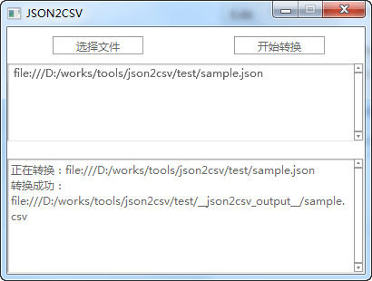

[JSON文件和CSV文件互转工具](http://zengrong.net/post/1788.htm)

工作需要，写了这么一个 JSON和CSV互转的小工具。

## 界面

<!--more-->

## 源码
<https://github.com/zrong/json2csv>

## JSON范例
<pre>
{"widget": {
    "debug": "on",
    "window": {
        "title": "Sample Konfabulator Widget",
        "name": "main_window",
        "width": 500,
        "height": 500
    },
    "image": { 
        "src": "Images/Sun.png",
        "name": "sun1",
        "hOffset": 250,
        "vOffset": 250,
        "alignment": "center"
    },
    "text": {
        "data": "Click Here",
        "size": 36,
        "style": "bold",
        "name": "text1",
        "hOffset": 250,
        "vOffset": 100,
        "alignment": "center",
        "onMouseUp": "sun1.opacity = (sun1.opacity / 100) * 90;"
    }
}}  
</pre>

## 转换成的CSV
<pre>
widget,text,onMouseUp,sun1.opacity = (sun1.opacity / 100) * 90;
widget,text,style,bold
widget,text,alignment,center
widget,text,name,text1
widget,text,data,Click Here
widget,image,name,sun1
widget,image,src,Images/Sun.png
widget,image,alignment,center
widget,debug,on,
widget,window,name,main_window
widget,window,title,Sample Konfabulator Widget
</pre>
