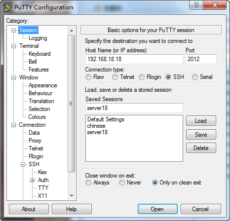
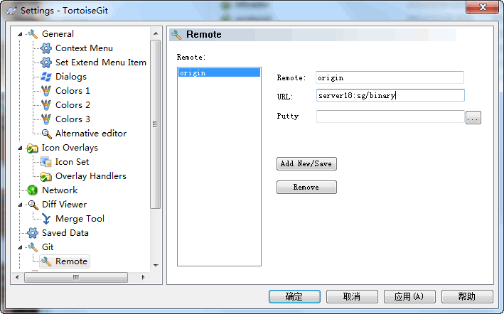
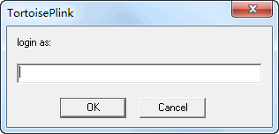

[在TortoiseGit中使用SSH host](http://zengrong.net/post/1775.htm)

## git命令行与OpenSSH

在OpenSSH中，我们可以很方便的通过编辑 `~/.ssh/config` 文件来为git指定不同的host，达到使用不同的端口，不同的密钥访问git服务的目的。看看下面这个例子：

`192.168.18.18` 这台服务器的SSH服务器使用2012端口，我可以使用 `git clone git@server18:myrepo.git` 来获取我的版本库；
我在bitbucket上有两个帐号 `test` 和 `release`，需要使用不同的密钥。我可以使用 `git clone bitbucket_test:myrepo.git` 和 `git clone bitbucket_release:myrepo.git` 来获取。

<pre>
host server18
    HostName 192.168.18.18
    port 2012
    IdentityFile ~/.ssh/server18

host bitbucket_test
    HostName bitbucket.org
    port 22
    User git
    IdentityFile ~/.ssh/bitbucket_test
    
host bitbucket_release
    HostName bitbucket.org
    port 22
    User git
    IdentityFile ~/.ssh/bitbucket_release
</pre>

## TortoiseGit与PuTTY

那[TortoiseGit](http://code.google.com/p/tortoisegit/)怎么办？我在TortoiseGit依赖的 `Git for windows` 环境中进行了如上设置，但没有起作用。TortoiseGit并不认识 `~/.ssh/conifg` 配置文件。

这是因为TortoiseGit基于 [PuTTY](http://www.chiark.greenend.org.uk/~sgtatham/putty/download.html) 进行验证。我们需要在PuTTY中进行类似的设置。步骤如下：

1. TortoiseGit并没有自带PuTTY客户端，你需要先去[下载一个](http://www.chiark.greenend.org.uk/~sgtatham/putty/download.html)。
2. 在 `Session` 界面，设置 `Host Name` 和 `Port`：

3. 在 `Connect->SSH->Auth` 界面，设置 `Private Key`：

4. 回到 Session 界面，保存 Session。

有了 Session 之后，就可以在TortoiseGit中将这个 Session Name 作为服务器URL连接，如下图：

我没有找到办法在 Session 设置中找到设置用户名的地方，因此如果Tortoise出现这样的提示：

只需要把URL设置成 `git@server18:sg/binary` 即可。

## 参考文章

关于TortoiseGit安装和配置，可参考：[使用Git、Git GUI和TortoiseGit](http://zengrong.net/post/1722.htm)
<http://code.google.com/p/tortoisegit/wiki/UsingPuTTY>
